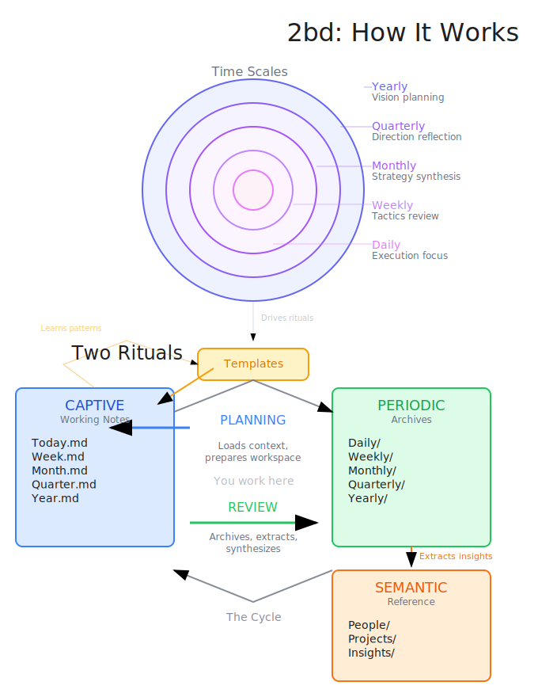

# 2bd (Second Brain Daemon)

A personal knowledge system that runs itself—powered by Claude, driven by daily rituals, stored in markdown.

## Why 2bd?

Most productivity systems fail because they depend on you to maintain them. Miss a few days, and everything falls out of date.

2bd runs itself. Daily **rituals** archive your notes, synthesize insights, and prepare tomorrow's workspace. You write in markdown files that sync to the cloud. Claude handles the housekeeping.

## Core Philosophy

Notes are organized by **metabolic state**—how active and volatile they are—rather than by topic.

| State | Purpose |
|-------|---------|
| **Captive** | Working notes — high-velocity, volatile intake |
| **Synthetic** | Active drafts — projects in progress |
| **Periodic** | Archives — the permanent timeline |
| **Semantic** | Reference — crystallized knowledge |
| **Systemic** | Structure — templates, workflows |

## How It Works

Time scales nest inside each other, each feeding into the next:



Two rituals drive the system:

- **Planning** — Prepares your working notes from templates, synthesizes prior knowledge
- **Review** — Archives working notes to Periodic, synthesizes forward

```bash
cd ~/Code/2bd-engine
claude skill run ritual-planning-daily   # morning
claude skill run ritual-review-daily     # evening
```

---

## Getting Started

### Prerequisites

- [Claude Code CLI](https://docs.anthropic.com/en/docs/claude-code)
- Markdown editor (Obsidian recommended)
- Cloud sync folder (OneDrive, iCloud, Dropbox)

### Quick Start

```bash
# Clone the engine
git clone https://github.com/bugroger/2bd ~/Code/2bd-engine
cd ~/Code/2bd-engine

# Create your vault
claude skill run init --args "fresh --vault=~/OneDrive/2bd-vault"

# Optional: symlink for convenience
ln -s ~/OneDrive/2bd-vault ./vault

# Open vault in Obsidian, then start planning
claude skill run ritual-planning-daily
```

### New Computer

If your vault already exists elsewhere:

```bash
cd ~/Code/2bd-engine
claude skill run init --args "reconnect --vault=~/OneDrive/2bd-vault"
ln -s ~/OneDrive/2bd-vault ./vault
```

### Migrating from Combined Repo

If you have an existing 2bd repo with personal content mixed in:

```bash
claude skill run migrate --args "--vault=~/OneDrive/2bd-vault"
```

### Configuration

The engine stores vault path in `.claude/config.md` (git-ignored):

```markdown
# 2bd Engine Configuration

## Vault

vault_path: /Users/you/OneDrive/2bd-vault
```

All skills read this config to find your vault. If you move your vault:

```bash
claude skill run init --args "reconnect --vault=/new/path"
ln -sf /new/path ./vault
```

### Update Your Profile

```bash
claude skill run init --args "profile"
```

---

## Architecture

### Engine + Vault

2bd separates **system** (engine) from **content** (vault):

```
~/Code/2bd-engine/                  ~/OneDrive/2bd-vault/
├── .claude/                        ├── 00_Brain/
│   ├── skills/                     │   ├── Captive/ (working notes)
│   │   └── init/assets/scaffold/   │   ├── Periodic/ (archives)
│   └── config.md  ← vault path     │   └── Systemic/
└── README.md                       │       └── Templates/
                                    ├── 01_Projects/
                                    └── 02_Areas/
```

- **Engine** = Skills, docs — git-tracked
- **Vault** = Your notes, templates, archives, projects — cloud-synced
- **Scaffold** = Template copied to vault during init (then unused)
- **Always run Claude from the engine directory**

During `init`, the scaffold is copied to your vault. After that, skills always reference the vault directly—templates, directives, and all content live in your vault, not the engine.

### Vault Structure

After init, your vault contains everything—templates, directives, and all your content:

```
2bd-vault/
├── 00_Brain/
│   ├── ✱ Home.md                # Central hub
│   ├── Captive/                 # Working notes (you write here)
│   │   ├── Today.md
│   │   ├── Week.md
│   │   ├── Month.md
│   │   ├── Quarter.md
│   │   └── Year.md
│   ├── Periodic/                # Archives (rituals write here)
│   │   ├── Daily/               # YYYY-MM-DD.md
│   │   ├── Weekly/              # YYYY-Www.md
│   │   ├── Monthly/             # YYYY-MM.md
│   │   ├── Quarterly/           # YYYY-QN.md
│   │   └── Yearly/              # YYYY.md
│   ├── Semantic/                # Crystallized knowledge
│   │   └── {ritual-name}/       # (created on first use)
│   │       └── insights.md
│   ├── Synthetic/               # Active drafts & observations
│   │   └── {ritual-name}/       # (created on first use)
│   │       └── observations.md
│   └── Systemic/
│       ├── Templates/           # Your templates (customize freely)
│       └── Directives/          # Your profile & AI personality
├── 01_Projects/
│   └── ✱ Projects.md
├── 02_Areas/
│   ├── People/                  # Relationship notes
│   │   └── ✱ People.md
│   └── Insights/                # Thematic learnings
│       └── ✱ Insights.md
├── 04_Archives/
└── .obsidian/
```

---

## Working with 2bd

### Daily Usage

**Always run Claude from the engine directory:**

```bash
cd ~/Code/2bd-engine

# Morning planning
claude skill run ritual-planning-daily

# Evening review
claude skill run ritual-review-daily
```

### Obsidian Integration

2bd uses Obsidian as the primary interface for writing and browsing, while Claude CLI handles ritual execution.

**Morning:**
1. Terminal: `claude skill run ritual-planning-daily`
2. Obsidian: Open Today.md (`Cmd+Shift+D`) and work through the day

**Throughout Day:**
- Write in Today.md (meetings, 1:1s, completed work, actions)
- Capture 1:1 conversations—rituals will extract to People/
- Navigate projects via ✱ Projects.md

**Evening:**
1. Obsidian: Complete Today.md sections (Wins, Insights, Completed)
2. Terminal: `claude skill run ritual-review-daily`

#### Hotkeys

| Hotkey | Action |
|--------|--------|
| `Cmd+Shift+D` | Open Today.md |
| `Cmd+Shift+W` | Open Week.md |
| `Cmd+Shift+M` | Open Month.md |
| `Cmd+Shift+Q` | Open Quarter.md |
| `Cmd+Shift+H` | Open ✱ Home.md |
| `Cmd+Shift+G` | Open graph view |

#### Templater

Templater automatically applies templates when creating files:
- New file in `01_Projects/` → uses project.md
- New file in `02_Areas/People/` → uses person.md
- New file in `02_Areas/Insights/` → uses insight.md

### Key Files

**In Vault (after init):**
- **Central Hub:** `00_Brain/✱ Home.md`
- **Working notes:** `00_Brain/Captive/` (Today.md, Week.md, etc.)
- **Archives:** `00_Brain/Periodic/` (Daily/, Weekly/, etc.)
- **Templates:** `00_Brain/Systemic/Templates/` (customize these)
- **Directives:** `00_Brain/Systemic/Directives/`

**In Engine:**
- **Skills:** `.claude/skills/`
- **Scaffold:** `.claude/skills/init/assets/scaffold/` (used only during init)
- **Config:** `.claude/config.md`

---

## Concepts

### Captive Notes

Your active working space in `00_Brain/Captive/`:
- **Today.md** — Daily capture, meetings, tasks
- **Week.md** — Weekly focus and progress
- **Month.md** — Monthly themes and goals
- **Quarter.md** — Quarterly direction
- **Year.md** — Annual vision

High-velocity, volatile. Planning rituals prepare these from templates.

### Periodic Notes

Timeline-based archives in `00_Brain/Periodic/`. Each period gets a unique, consecutive note:
- `2026-02-08.md`, `2026-02-09.md`, ...
- `2026-W06.md`, `2026-W07.md`, ...

Review rituals archive Captive notes here. This is the permanent record.

### Hubs

Central navigation notes that organize content by domain:
- **✱ Home** — Central hub in `00_Brain/`
- **✱ Projects** — Active work in `01_Projects/`
- **✱ People** — Relationships in `02_Areas/People/`
- **✱ Insights** — Thematic learnings in `02_Areas/Insights/`

### Rituals

Scheduled operations that drive the productivity loop:

| Ritual | When | Purpose |
|--------|------|---------|
| **Daily Planning** | Morning | Prepare Today.md with priorities |
| **Daily Review** | Evening | Archive Today.md, synthesize forward |
| **Weekly Planning** | Monday | Prepare Week.md with weekly focus |
| **Weekly Review** | Sunday | Archive Week.md, synthesize to Month |
| **Monthly Planning** | First of month | Prepare Month.md with theme |
| **Monthly Review** | End of month | Archive Month.md, synthesize patterns |
| **Quarterly Planning** | Start of quarter | Prepare Quarter.md with direction |
| **Quarterly Review** | End of quarter | Archive Quarter.md, assess direction |
| **Yearly Planning** | January | Set vision, prepare Year.md |
| **Yearly Review** | December | Archive Year.md, capture insights |

See [docs/rituals.md](docs/rituals.md) for ritual architecture.

### Actions

One-shot helpers you invoke on-demand:

| Action | Purpose | Usage |
|--------|---------|-------|
| **init** | Bootstrap or configure vault | `claude skill run init` |
| **create-project** | Initialize new project file | `claude skill run create-project --args "Name"` |

---

## Integrations

### Calendar (macOS)

2bd can fetch calendar events from macOS Calendar using the `ekctl` CLI tool.

#### Setup

1. **Install ekctl:**
   ```bash
   brew install schappim/tap/ekctl
   ```

2. **Grant Calendar Access:**
   On first run, grant permission when asked.

3. **List calendars:**
   ```bash
   ekctl list calendars
   ```

4. **Create aliases:**
   ```bash
   ekctl alias set work "YOUR-WORK-CALENDAR-ID"
   ekctl alias set personal "YOUR-PERSONAL-CALENDAR-ID"
   ```

5. **Configure the skill:**
   Edit `.claude/skills/fetch-calendar/calendars.json`:
   ```json
   {
     "calendars": ["work", "personal"],
     "default_scope": "today",
     "settings": {
       "work_hours": { "start": "09:00", "end": "18:00" },
       "min_focus_block_minutes": 30,
       "one_on_one_patterns": ["1:1", "1-1"]
     }
   }
   ```

6. **Test:**
   ```bash
   ekctl list events --calendar work \
     --from "$(date -v0H -v0M -v0S +%Y-%m-%dT%H:%M:%S%z)" \
     --to "$(date -v23H -v59M -v59S +%Y-%m-%dT%H:%M:%S%z)"
   ```

Planning rituals use calendar data to:
- Pre-populate the Meetings section in Today.md
- Identify 1:1s and apply the 1:1 template
- Calculate focus blocks between meetings

## Integrations

### GitHub

Use the `gh` CLI for all GitHub interactions:

```bash
# Issues
gh issue create --title "Title" --body "Description"
gh issue list
gh issue view 123

# Pull Requests
gh pr create --title "Title" --body "Description"
gh pr list
gh pr view 123
```

If not authenticated: `gh auth login`

---

## Customization

### Directives

Personalize how Claude interacts with you. Located in `00_Brain/Systemic/Directives/`:

| File | Purpose |
|------|---------|
| `user-profile.md` | Who you are — name, role, goals, growth edge |
| `ai-personality.md` | How Claude communicates — tone, directness, coaching style |

Update your profile:
```bash
claude skill run init --args "profile"
```

### Templates

Templates live in your vault at `00_Brain/Systemic/Templates/` (copied from scaffold during init):

- **Captive/** — Templates for working notes (today.md, week.md, etc.)
- **Periodic/** — Templates for archive notes (daily.md, weekly.md, etc.)
- **Projects/** — project.md
- **Areas/People/** — person.md

Customize these freely—they're yours. Skills read templates from your vault, not the engine.

---

## Naming Conventions

| Type | Format | Example |
|------|--------|---------|
| Hubs | `✱ Title.md` | `✱ Home.md`, `✱ Projects.md` |
| Daily | `YYYY-MM-DD.md` | `2026-02-08.md` |
| Weekly | `YYYY-Www.md` | `2026-W06.md` |
| Monthly | `YYYY-MM.md` | `2026-02.md` |
| Quarterly | `YYYY-QN.md` | `2026-Q1.md` |
| Yearly | `YYYY.md` | `2026.md` |
| Projects | `YYYY-MM-DD-name.md` | `2026-03-15-launch.md` |
| People | `FirstNameLastInitial.md` | `EstherS.md` |

---

## Philosophy

**Trust the rituals.** Run them even when you don't feel like it. The magic is in the rhythm.

**Capture in Captive.** Your working notes are volatile. Periodic is the permanent record.

**The system augments.** It scaffolds your thinking. You supply the content.

---

## Acknowledgments

- **Tiago Forte** – [PARA Method](https://fortelabs.com/blog/para/)
- **Andy Matuschak** – [Evergreen Notes](https://notes.andymatuschak.org/Evergreen_notes)
- **Matthias Hilse** – [Forever Notes](https://www.myforevernotes.com/)

## License

MIT License. See [LICENSE](LICENSE).
